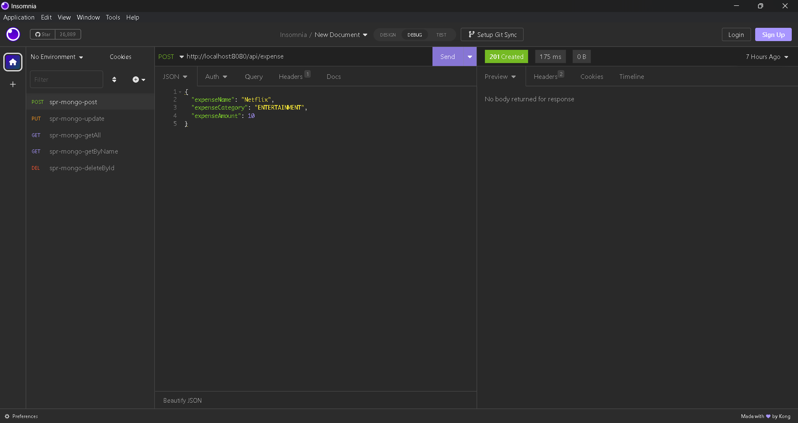

# Springboot MongoDB CRUD Tutorial
* Insert Post
  ```
   [POST] http://localhost:8080/api/expense
   ```
  


* Update Post
  ```
   [PUT] http://localhost:8080/api/expense
   ```
  


* Get All Post
  ```
   [GET] http://localhost:8080/api/expense
   ```
  


* Get Post By Name
  ```
   [GET] http://localhost:8080/api/expense/Netflix
   ```
  


* Delete Post By ID
  ```
   [DELETE] http://localhost:8080/api/expense/6402313a05df584e700b0250
   ```
  


